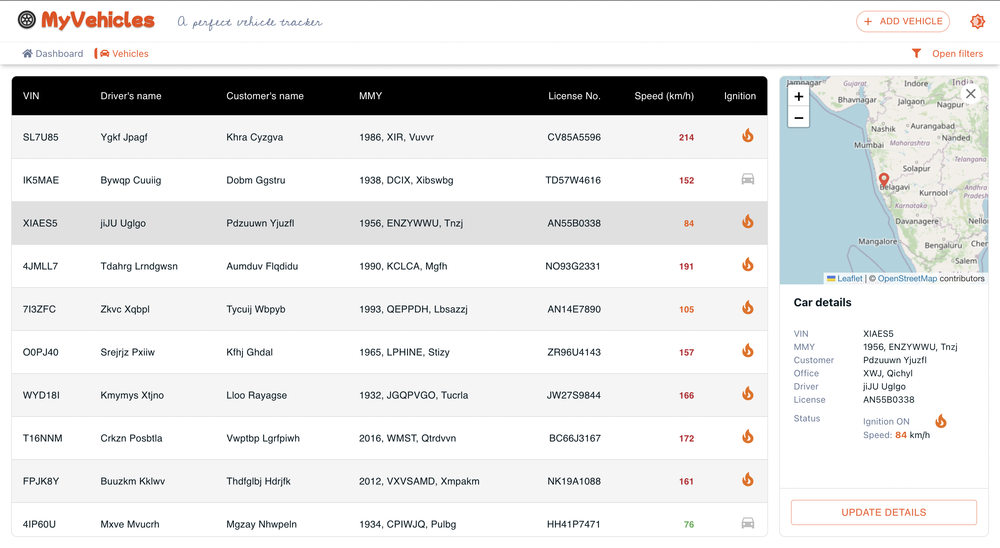
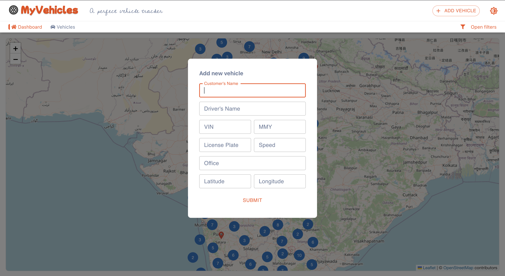
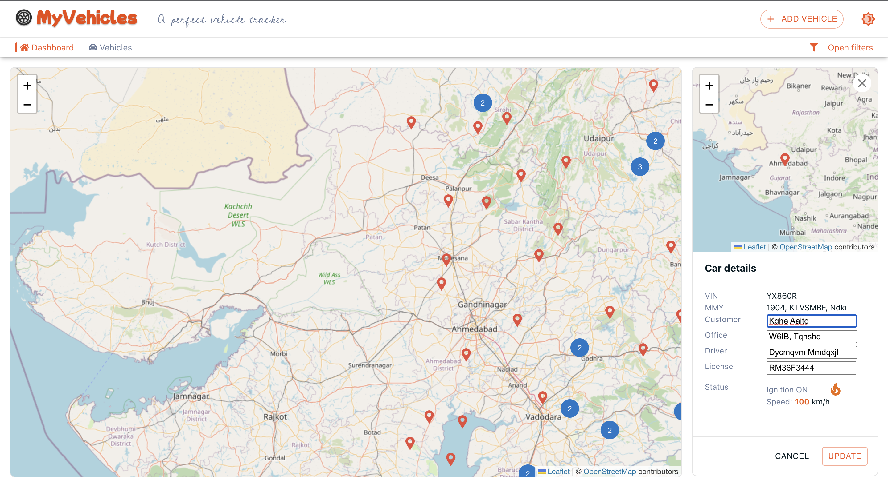
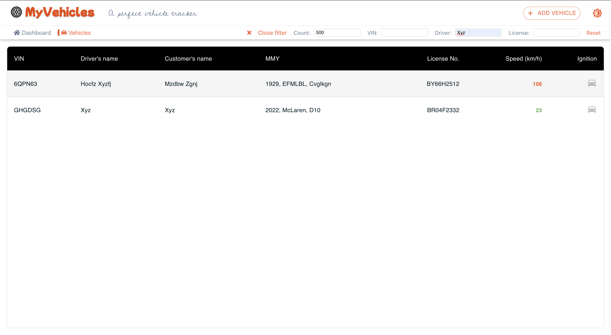
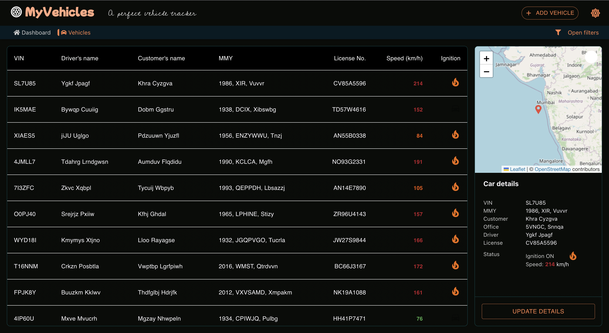

# MotorqAssignment: Vehicle Management

### Live (hosted) at: [https://motorq-fend.vercel.app](https://motorq-fend.vercel.app)

### Video Demo: [https://www.youtube.com/watch?v=JtDhxVmmp_Q](https://www.youtube.com/watch?v=JtDhxVmmp_Q)

- Stack used: MongoDB, Express, React, Node (MERN)

## UI Snippets

### Dashboard


### Tooltip popup


### Vehicles table



### Add vehicle



### Edit vehicle



### Filter vehicles



### Dark mode



---

### API Endpoints

#### `GET` `/vehicles`

Request

`http://localhost:5000/vehicles?count=500&vin=WED78E`

Response

```json
[
  {
    "status": {
      "location": {
        "lat": 33.3545345345,
        "lon": 77.4535345
      },
      "ignition": false,
      "speed": 103
    },
    "_id": "619173491329bf9dbfddb238",
    "vin": "WED78E",
    "licensePlate": "GH12H2345",
    "driver": "Mijitu Kishli",
    "mmy": "2020, BMW, X5",
    "customerName": "Chizht Duinah",
    "office": "S12, Place, Name",
    "__v": 0
  }
]
```

#### `PATCH` `/vehicles/:id`

Request

`localhost:5000/vehicles/619173491329bf9dbfddb238`

Body

```json
{
  "licensePlate": "SD68K2345",
  "driver": "Gygnu Kishli",
  "customerName": "Hjugu Duinah",
  "office": "JH12, Place, Name"
}
```

Response

```json
{
  "status": {
    "location": {
      "lat": 33.3545345345,
      "lon": 77.4535345
    },
    "ignition": false,
    "speed": 103
  },
  "_id": "619173491329bf9dbfddb238",
  "vin": "WED78E",
  "licensePlate": "GH12H2345",
  "driver": "Mijitu Kishli",
  "mmy": "2020, BMW, X5",
  "customerName": "Chizht Duinah",
  "office": "S12, Place, Name",
  "__v": 0
}
```

## Other Endpoints

#### `GET` `/vehicles/:id`

- To get vehicle by ID

#### `POST` `/vehicles/populateData`

- To populate random data in database (`500` count at once)

---

## Run the Project

Clone the repository first.

```bash
git clone https://github.com/rajaabhaysingh/motorq-assignment.git
```

Navigate to server `cd/server`

```bash
$ npm i
$ npm start
```

In new terminal Navigate to client `cd/client`

```bash
$ npm i
$ npm start
```

On browser
[http://localhost:3000](http://localhost:3000) will open the application
